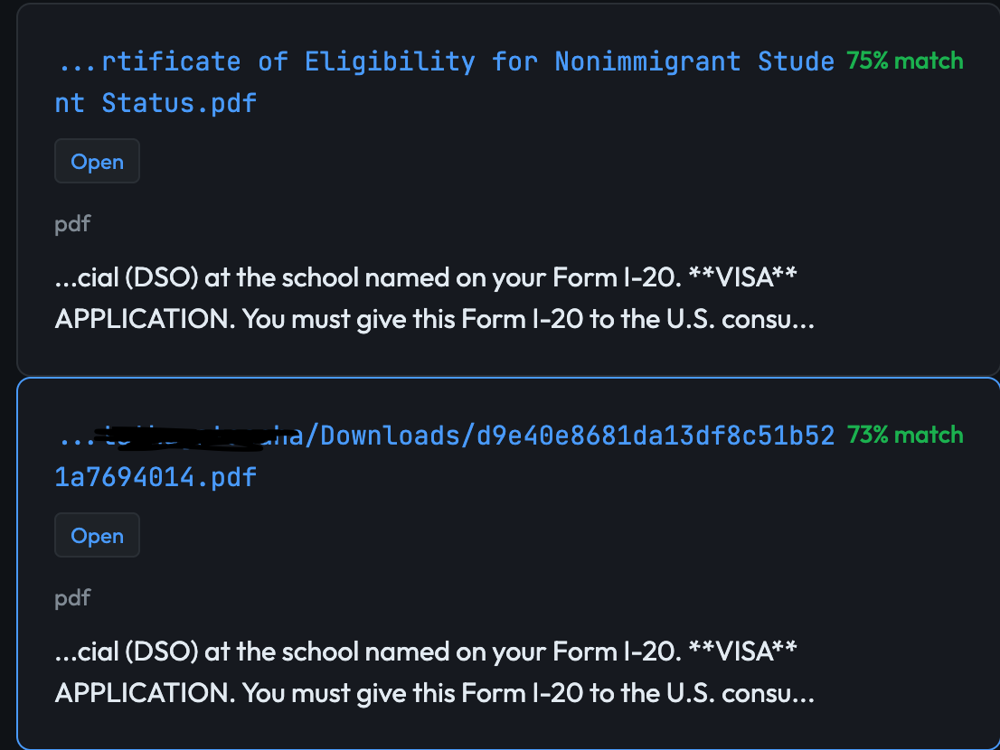
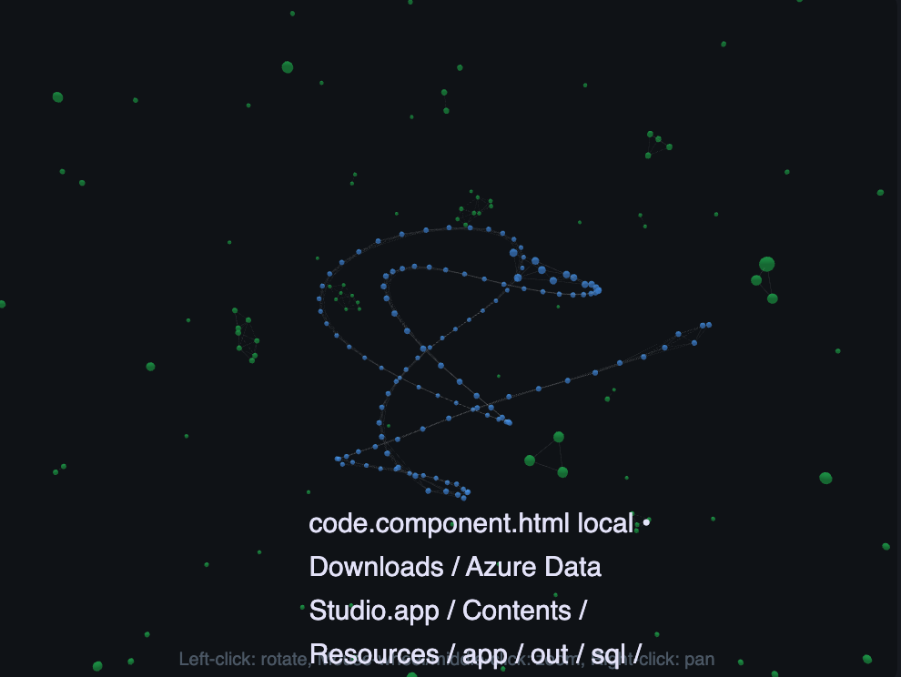

# 🚀 Local-Agent: High-Performance Hybrid Document Search Engine

A production-ready, AI-powered document search engine with hybrid retrieval (vector + lexical search) that can index and search your entire computer with lightning-fast performance. Built with concurrent processing, Apple Silicon optimization, and comprehensive file type support.

## ✨ Features

### 🔍 **Hybrid Document Search**
- **Multi-format Support**: PDF, DOCX, HTML, Markdown, Code files, Images (OCR)
- **System-wide Scanning**: Index your entire computer from root (/) with smart exclusions
- **Hybrid Retrieval**: Combines vector similarity search with BM25 lexical search for best results
- **Semantic + Keyword**: AI-powered search that understands context and meaning, with exact keyword fallback
- **Search Filters**: Filter by file type (e.g. `pdf, docx`), path contains, or exclude images for documents-only search

### 📷 **OCR (Optical Character Recognition)**
- **Multiple Backends**: Tesseract (default), PaddleOCR, EasyOCR — choose based on speed/accuracy needs
- **AI-based OCR**: PaddleOCR (~12 fps on GPU) and EasyOCR (~4 fps) for faster, more accurate image text extraction
- **Selective OCR**: `ocr_paths` config limits OCR to specific folders (e.g. Pictures, Screenshots) for faster indexing
- **Smart Prioritization**: Text files indexed first, images last — improves perceived indexing speed

### ⚡ **High-Performance Architecture**
- **BFS Streaming Indexer**: Level-by-level, checkpointable indexing with time/size caps
- **Apple Silicon MPS**: GPU acceleration for embeddings on M1/M2/M3 Macs
- **Batch Processing**: 4000-vector batches for maximum throughput
- **Qdrant Server**: Professional vector database with gRPC support and HNSW optimization
- **Cached Model Loading**: Thread-safe singleton — 246,000× faster subsequent model access

### 🗄️ **Advanced Storage**
- **Dual Storage**: Qdrant for vectors + SQLite FTS5 for lexical search
- **Smart Cataloging**: File metadata, chunk tracking, and content hashing
- **Incremental Updates**: Only processes changed files based on SHA256 hashing
- **LRU Caching**: Fast repeated searches with configurable cache (default 256 entries)
- **Atomic Transactions**: All-or-nothing database operations prevent corruption

### 📊 **GraphQL API & Analytics**
- **GraphQL Endpoint**: `/graphql` with GraphiQL IDE for flexible metrics queries
- **Metrics**: System status, database stats, recent indexing/searches, aggregated summaries
- **Analytics**: File type distribution, top queries, search/index time series, latency percentiles (p50/p95/p99)
- **Auto-recorded Stats**: Indexing and search operations logged to `index_stats` and `search_stats` tables

### 🌐 **Web UI**
- **Modern Interface**: Refined dark theme with Sora typography and teal accents
- **3D Visualization**: Interactive force-directed graph of indexed files and links
- **Category View**: AI-categorized file breakdown with Ollama labels
- **Analytics Tab**: Built-in dashboard for file types, search stats, top queries, latency
- **Collapsible Filters**: File type, path contains, query expansion, exclude images
- **Open in App**: One-click to open local files in default application

### 🛠️ **Developer-Friendly**
- **Clean Architecture**: Modular design with separate storage, indexing, retrieval, and OCR layers
- **Comprehensive Testing**: Full test suite with fixtures and benchmarks
- **Performance Metrics**: Detailed timing, analytics, and GraphQL introspection
- **Extensible**: Plugin architecture for custom file types and parsers

## 📸 Preview

### Search Results (Web UI)

Search returns local files and web links with relevance scores, content snippets, and quick actions. Local files include an **Open** button to open in your default app.



### 3D File Visualization

Explore your indexed content as an interactive 3D force-directed graph. Blue nodes represent local files, green nodes represent web links. Left-click to rotate, right-click to pan.



## 🚀 Quick Start

### Prerequisites
- Python 3.8+
- 4GB+ RAM (8GB+ recommended)
- macOS (for MPS acceleration) or Linux
- Docker (for Qdrant server)

### Installation

See **[INSTALL.md](INSTALL.md)** for full installation instructions.

**Quick start:**
```bash
git clone https://github.com/yourusername/local-agent.git && cd local-agent && ./install.sh
source .venv/bin/activate
python3 local-agent/cli.py status
```

### First-Time Setup

```bash
# Index a directory
python3 local-agent/cli.py bfs-index ~/Documents --max-items 1000

# Search for content
python3 local-agent/cli.py find "your search query" --show-context
```

### Web UI (Optional)

```bash
uvicorn web.server:app --reload --port 8000
```

See [web/README.md](web/README.md) for details. Open **http://localhost:6333/dashboard** for vector visualization.

### GraphQL API (Metrics)

A GraphQL endpoint at `/graphql` exposes metrics for dashboards and monitoring:

```bash
# Interactive GraphiQL IDE
open http://localhost:8000/graphql

# Example query (all metrics in one call)
curl -X POST http://localhost:8000/graphql \
  -H "Content-Type: application/json" \
  -d '{"query": "{ metrics(recentLimit: 5) { system { status filesIndexed vectorsCount } database { totalFiles totalChunks } indexSummary { totalOps avgDuration } searchSummary { totalSearches cacheHits } } }"}'
```

**Available queries:**
- **Metrics:** `systemStatus`, `databaseStats`, `recentIndexing`, `recentSearches`, `indexStatsSummary`, `searchStatsSummary`, `metrics` (all-in-one)
- **Analytics:** `fileTypeDistribution`, `topQueries`, `searchTimeSeries`, `indexTimeSeries`, `searchPercentiles`, `analytics` (full dashboard)

**Example analytics query:**
```graphql
{
  analytics(
    topQueriesLimit: 20
    searchSinceHours: 24
    indexSinceHours: 168
  ) {
    fileTypeDistribution { fileType count }
    topQueries { query count avgDuration }
    searchPercentiles { p50 p95 p99 }
    searchTimeSeries { bucketStr count avgDuration cacheHits }
  }
}
```

## 📖 Usage Examples

### ✅ Currently Working Commands

```bash
# Index files and directories with BFS streaming
python3 local-agent/cli.py bfs-index ~/Documents
python3 local-agent/cli.py bfs-index ~/Documents --max-items 500
python3 local-agent/cli.py bfs-index ~/Desktop --ocr

# Search for content with hybrid retrieval
python3 local-agent/cli.py find "Python programming"
python3 local-agent/cli.py find "resume" --show-context
python3 local-agent/cli.py find "TODO" --case-sensitive --exact

# Check system status
python3 local-agent/cli.py status

# Index browser bookmarks and history
python3 local-agent/cli.py index-browser

# Reset database and start fresh
python3 local-agent/cli.py reset-db

# Daemon mode: auto-index on startup + periodic re-index when idle
python3 local-agent/cli.py daemon --startup-index --idle-updates
python3 local-agent/cli.py daemon --startup-index --idle-updates --interval 60  # every 60 min
```

See [BROWSER_INDEXING.md](BROWSER_INDEXING.md) for browser indexing details.

### 🚧 Coming Soon (Not Yet Implemented)

```bash
# Ask questions with LLM integration (PLANNED)
python3 local-agent/cli.py ask "What documents mention machine learning?"

# System-wide root scanning (PLANNED)
python3 local-agent/cli.py bfs-index / --root-scan
```

### Advanced Options

```bash
# High-performance indexing with custom parameters
python3 local-agent/cli.py bfs-index ~/Documents \
  --max-tokens 1500 \
  --overlap 100 \
  --ocr \
  --max-pdf-pages 100

# Thorough search with pagination
python3 local-agent/cli.py find "resume" \
  --page 1 \
  --per-page 20 \
  --show-context
```

### Benchmarking

```bash
# Run performance benchmark
python3 -m search.bench --paths ~/Documents ~/Desktop

# Test search performance
python3 -m search.bench --search-only --query "test query"
```

## 🏗️ Architecture

### New Hybrid Search Architecture

```
┌─────────────────┐    ┌──────────────────┐    ┌─────────────────┐
│   BFS Indexer   │───▶│  File Extractor  │───▶│ Text Chunker    │
│(checkpointable) │    │ (PDF/HTML/DOCX)  │    │ (overlap=80)    │
└─────────────────┘    └──────────────────┘    └─────────────────┘
                                                        │
┌─────────────────┐    ┌──────────────────┐             │
│   Qdrant Store  │◀───│  Embedder        │◀────────────┘
│ (HNSW vectors)  │    │ (MPS + batch)    │
└─────────────────┘    └──────────────────┘
         │
         ▼
┌─────────────────┐    ┌──────────────────┐
│ SQLite Catalog  │    │  FTS5 Lexical    │
│ (metadata)      │    │  (BM25 search)   │
└─────────────────┘    └──────────────────┘
         │                       │
         └───────────────────────┼─────────────────────────┐
                                 │                         │
                                 ▼                         ▼
                        ┌─────────────────┐    ┌─────────────────┐
                        │ Hybrid Retriever│◀───│ Search Results  │
                        │ (merge & score) │    │ (ranked + dedup)│
                        └─────────────────┘    └─────────────────┘
```

### Module Structure

```
search/
├── __init__.py          # Package initialization
├── config.py            # Configuration management
├── types.py             # Data contracts (Chunk, SearchHit, etc.)
├── schemas.sql          # SQLite schema (index_stats, search_stats, db_stats)
├── ids.py               # ID generation utilities
├── storage.py           # Qdrant + SQLite storage (with analytics methods)
├── indexer.py           # BFS streaming indexer (with OCR path filtering)
├── retriever.py         # Hybrid retrieval (with file-type filters)
├── ocr.py               # OCR backends (Tesseract, PaddleOCR, EasyOCR)
├── model_loader.py      # Thread-safe cached model loading
├── snippets.py          # Text snippet generation
├── api.py               # Public API with caching + metrics recording
├── browser_indexer.py   # Chrome/Firefox bookmarks & history
└── bench.py             # Benchmarking suite

web/
├── server.py            # FastAPI server (REST + GraphQL)
├── graphql_schema.py    # GraphQL metrics & analytics
└── static/             # HTML, CSS, JS (3D viz, Analytics tab)

local-agent/
└── cli.py               # CLI interface

tests/
└── test_search.py       # Comprehensive test suite
```

### File Type Support

| Type | Extensions | Parser | Notes |
|------|------------|--------|-------|
| **Text** | `.txt`, `.md`, `.markdown` | Native | UTF-8 encoding |
| **PDF** | `.pdf` | pypdfium2 → pdfminer.six → OCR | Robust extraction pipeline |
| **Word** | `.docx`, `.doc` | python-docx | Full document support |
| **HTML** | `.html`, `.htm` | BeautifulSoup + lxml | Clean text extraction |
| **Code** | `.py`, `.js`, `.ts`, `.java`, `.cpp`, `.c`, `.h` | Native | Syntax highlighting ready |
| **Images** | `.png`, `.jpg`, `.jpeg`, `.gif`, `.bmp`, `.tiff` | Tesseract / PaddleOCR / EasyOCR | Optional, requires `--ocr`; set `ocr_backend` in config |
| **Data** | `.csv`, `.tsv`, `.json`, `.yaml`, `.xml` | Native | Structured data |

### Performance Optimizations

- **BFS Streaming**: Level-by-level processing with checkpointing
- **Parallel Extraction**: `extraction_workers: 4` for concurrent PDF/DOCX/OCR extraction
- **MPS Acceleration**: Uses Apple Silicon GPU for 2-3x faster embeddings
- **Batch Processing**: 2048 embed batch, 8000 upsert batch, `embed_accumulate_batch` for cross-file batching
- **SQLite WAL**: Write-ahead logging for faster concurrent reads during search
- **Parallel Search**: Vector (Qdrant) and lexical (FTS5) run concurrently when `parallel_search: true`
- **RRF Merge**: Optional Reciprocal Rank Fusion (`merge_strategy: rrf`) for more accurate ranking
- **Normalized Embeddings**: `normalize_embeddings: true` improves cosine similarity
- **Smart Exclusions**: Skips system files, caches, and build artifacts
- **Vector Optimization**: HNSW index with tuned parameters (m=32, ef_construct=256)

## 🔧 Configuration

### Environment Variables

```bash
# Optional: Custom Qdrant server
export QDRANT_URL="http://localhost:6333"

# Optional: Custom model
export EMBEDDING_MODEL="all-MiniLM-L6-v2"

# Optional: Custom storage path
export STORAGE_PATH="./store"

# OCR
export LA_INDEX_OCR_ENABLED="true"
export LA_INDEX_OCR_BACKEND="paddleocr"  # tesseract | paddleocr | easyocr
export LA_INDEX_OCR_PATHS="Pictures,Screenshots"
```

### Config File (`config.yaml`)

```yaml
# Default configuration
index:
  max_tokens: 1200
  overlap: 80
  embed_batch: 2048
  upsert_batch: 8000
  allow_exts: [".txt", ".md", ".markdown", ".pdf", ".docx", ".html", ".htm", ".rtf"]
  ocr_enabled: false
  ocr_only_for_images: true
  ocr_paths: []  # e.g. ["Pictures", "Screenshots"] to limit OCR to those folders
  ocr_backend: tesseract   # tesseract | paddleocr | easyocr (AI backends faster on GPU)
  max_pdf_pages: 50
  extraction_timeout: 10
  extraction_workers: 4    # Parallel extraction (0=disabled)

search:
  top_k: 50
  lex_k: 100
  vec_k: 150
  parallel_search: true   # Run vector + lexical in parallel
  merge_strategy: weighted  # or rrf for Reciprocal Rank Fusion
  merge_k: 200
  timeout_sec: 2.5
  cache_size: 256  # Search result cache
  bm25_weight: 0.55
  cosine_weight: 0.45
  exact_boost: 0.20
  early_pos_boost: 0.10
  snippet_radius: 50

qdrant:
  url: "http://localhost:6333"
  prefer_grpc: true
  collection: "local_agent_vectors"
  dim: 384
  hnsw_config:
    m: 32
    ef_construct: 256
  optimizers_config:
    default_segment_number: 4

paths:
  store: "store"
  catalog: "store/catalog.db"
  frontier: "store/frontier.json"
  cache: "store/cache"
```

## 🐳 Docker Deployment

### Quick Start with Docker

```bash
# Start Qdrant server
docker-compose up -d

# Build and run local-agent
docker build -t local-agent .
docker run -v ~/Documents:/data local-agent bfs-index /data
```

### Docker Compose

```yaml
version: '3.8'
services:
  qdrant:
    image: qdrant/qdrant:latest
    ports:
      - "6333:6333"
      - "6334:6334"
    volumes:
      - qdrant_storage:/qdrant/storage
    environment:
      - QDRANT__SERVICE__HTTP_PORT=6333
      - QDRANT__SERVICE__GRPC_PORT=6334
    restart: unless-stopped

  local-agent:
    build: .
    volumes:
      - ~/Documents:/data
      - ./store:/app/store
    depends_on:
      - qdrant
    environment:
      - QDRANT_URL=http://qdrant:6333

volumes:
  qdrant_storage:
```

## 📊 Performance Benchmarks

### Typical Performance (Apple Silicon M2)

| Operation | Files | Time | Rate |
|-----------|-------|------|------|
| **BFS Indexing** | 1,000 PDFs | 3.2 min | 312 files/min |
| **Embedding** | 5,000 chunks | 45 sec | 6,667 chunks/min |
| **Hybrid Search** | 10,000 vectors | 0.15 sec | 66,667 vectors/sec |
| **Vector Upsert** | 4,000 vectors | 2 sec | 2,000 vectors/sec |
| **FTS Search** | 50,000 chunks | 0.05 sec | 1,000,000 chunks/sec |

### Memory Usage

| Component | Memory |
|-----------|--------|
| **Base System** | 200 MB |
| **Embedding Model** | 400 MB |
| **Qdrant Server** | 500 MB |
| **SQLite Catalog** | 100 MB |
| **Total** | ~1.2 GB |

## 🛠️ Development

### Project Structure

```
.
├── search/                # Core search module
│   ├── config.py         # Configuration + env overrides
│   ├── storage.py        # Qdrant + SQLite (analytics methods)
│   ├── indexer.py        # BFS indexer + OCR path filtering
│   ├── retriever.py      # Hybrid retrieval + filters
│   ├── ocr.py            # Tesseract / PaddleOCR / EasyOCR
│   ├── api.py            # Search API + metrics recording
│   ├── browser_indexer.py
│   └── ...
├── web/
│   ├── server.py         # FastAPI (REST + GraphQL)
│   ├── graphql_schema.py  # Metrics & analytics schema
│   └── static/           # UI (index.html, css, js)
├── local-agent/cli.py    # CLI
├── store/                # catalog.db, frontier.json, cache/
├── config.yaml
└── requirements.txt
```

### Adding New File Types

```python
# In search/indexer.py
def _extract_text_from_file(path: Path, ocr_enabled: bool = False) -> str:
    """Extract text from file with robust fallback pipeline."""
    suffix = path.suffix.lower()
    
    if suffix == ".custom":
        return _extract_custom_format(path)
    # ... existing parsers
```

### Custom Embedding Models

```python
# In search/retriever.py
def embed_query(text: str) -> np.ndarray:
    """Embed query text using SentenceTransformer."""
    try:
        from sentence_transformers import SentenceTransformer
        # Use your preferred model
        model = SentenceTransformer("your-model-name", device=device)
        return model.encode([text])[0]
    except Exception as e:
        logger.error(f"Embedding failed: {e}")
        return np.zeros(384)  # Fallback
```

## 🔍 Troubleshooting

### Common Issues

**Q: "Qdrant client not available"**
```bash
# Start Qdrant server
docker-compose up -d
# Check if it's running
curl http://localhost:6333/health
```

**Q: "No module named 'search'"**
```bash
# Make sure you're in the project root
cd /path/to/local-agent
# The search module should be in the current directory
```

**Q: "How do I limit OCR to specific folders?"**

Set `ocr_paths: ["Pictures", "Screenshots"]` in `config.yaml`. OCR will only run on images under those paths, speeding up indexing when scanning mixed folders (e.g. Documents with few images).

**Q: "How do I use faster AI-based OCR?"**

Set `ocr_backend: paddleocr` or `ocr_backend: easyocr` in `config.yaml` (under `index:`). AI backends are faster on GPU (PaddleOCR ~12 fps, EasyOCR ~4 fps vs Tesseract ~8 fps on CPU). Install optional deps:
```bash
# PaddleOCR (recommended for GPU)
pip install paddlepaddle paddleocr

# EasyOCR (alternative)
pip install easyocr
```

**Q: "OCR not working"**
```bash
# Install Tesseract
brew install tesseract  # macOS
sudo apt install tesseract-ocr  # Ubuntu
# Enable OCR in config or use --ocr flag
```

**Q: "Slow indexing"**
```bash
# Use smaller batches for memory-constrained systems
python3 local-agent/cli.py bfs-index ~/Documents --max-items 100
# Or adjust batch sizes in config.yaml
```

**Q: "Search returns no results"**
```bash
# Check if content is indexed
python3 local-agent/cli.py status
# Reset and re-index if needed
python3 local-agent/cli.py reset-db
python3 local-agent/cli.py bfs-index ~/Documents
```

### Performance Tuning

```yaml
# Faster indexing (config.yaml)
index:
  extraction_workers: 4   # Parallel PDF/DOCX extraction
  embed_batch: 2048
  upsert_batch: 8000
  embed_accumulate_batch: 2048
  max_pdf_pages: 100

# Faster & more accurate search
search:
  parallel_search: true   # Vector + lexical in parallel
  merge_strategy: rrf    # RRF often more accurate than weighted
  cache_size: 512       # Larger cache for repeated queries

embedding:
  normalize_embeddings: true
  use_onnx: true        # 2-3x faster (pip install sentence-transformers[onnx])
```

For memory-constrained systems: reduce `embed_batch` to 512, `upsert_batch` to 2000, `extraction_workers` to 0.

## 🤝 Contributing

We welcome contributions! Please see our [Contributing Guide](CONTRIBUTING.md) for details.

### Development Setup

```bash
# Clone and setup
git clone https://github.com/yourusername/local-agent.git
cd local-agent
pip install -r requirements.txt
pip install -r requirements-dev.txt

# Run tests
python -m pytest tests/

# Run benchmarks
python3 -m search.bench --paths ~/Documents

# Format code
black search/ local-agent/
isort search/ local-agent/
```

## 🎯 Current Status & Roadmap

### ✅ What Works Now (v1.0+)

- **BFS Streaming Indexer**: Level-by-level, checkpointable indexing
- **Hybrid Search**: Vector (cosine similarity) + Lexical (BM25) search
- **Multi-Format Support**: PDF, DOCX, HTML, Markdown, Code files, Images (OCR)
- **Dual Storage**: Qdrant for vectors + SQLite FTS5 for lexical search
- **Apple Silicon MPS**: GPU acceleration for embeddings
- **Batch Processing**: Efficient 2048/8000 batch sizes
- **Smart Cataloging**: File metadata, chunk tracking, SHA256 hashing
- **CLI Interface**: `bfs-index`, `find`, `status`, `reset-db`, `index-browser`
- **Web UI**: Search interface with 3D viz, Categories, Analytics tab
- **REST API**: Search, index, status, open-file, visualization endpoints
- **GraphQL API**: Metrics, analytics, time series, percentiles
- **OCR**: Tesseract + PaddleOCR + EasyOCR with path-based filtering
- **Search Filters**: File type, path contains, exclude images
- **Browser Indexing**: Chrome/Firefox bookmarks and history

### 🚧 What's Coming Next (Priority Order)

#### Phase 2: Enhanced Search & UX
- [ ] **LLM Integration** - Question answering with context from indexed documents
- [ ] **Advanced Filters** - Date range, size, and custom metadata filters
- [ ] **Boolean Queries** - AND, OR, NOT operators for complex searches
- [ ] **Search History** - Track and reuse previous searches
- [ ] **Result Ranking** - Machine learning-based relevance scoring

#### Phase 3: Automation & Real-time
- [ ] **File System Watcher** - Real-time indexing of new/modified files
- [ ] **Auto-Indexing Daemon** - Background indexing with system idle detection
- [ ] **Incremental Updates** - Only re-index changed portions of files
- [ ] **Smart Scheduling** - Optimize indexing based on system load
- [ ] **Root Scanning** - Safe system-wide indexing with comprehensive exclusions

#### Phase 4: Interfaces & APIs
- [ ] **Browser Extension** - Search from browser with quick access
- [ ] **Mobile App** - iOS/Android apps for on-the-go search

#### Phase 5: Advanced Features
- [ ] **Multi-Language Support** - Embeddings for multiple languages
- [ ] **Custom Embedding Models** - Support for domain-specific models
- [ ] **Distributed Processing** - Multi-machine indexing for large datasets
- [ ] **Vector Quantization** - Reduce storage with compressed vectors
- [ ] **Semantic Caching** - Cache similar queries for faster responses
- [ ] **Plugin System** - Extensible architecture for custom parsers

#### Phase 6: Enterprise Features
- [ ] **User Authentication** - Multi-user support with permissions
- [ ] **Team Collaboration** - Shared indexes and search results
- [ ] **Audit Logging** - Track all indexing and search operations
- [ ] **Encryption** - At-rest and in-transit data encryption
- [ ] **Cloud Backup** - Automatic vector database backups
- [ ] **Monitoring Dashboard** - Prometheus/Grafana integration

### 🐛 Known Issues & Limitations

- **LLM Q&A**: Not yet implemented (returns placeholder message)
- **Root Scanning**: Safety features not complete for system-wide indexing
- **File Watchers**: Real-time updates require manual re-indexing
- **Concurrent Indexing**: Single-threaded BFS (future: parallel level processing)
- **Large PDFs**: Memory intensive for PDFs with >100 pages
- **OCR Speed**: Image OCR is slow (consider cloud OCR services)

### 📊 Performance Targets

| Metric | Current | Target (Phase 3) |
|--------|---------|------------------|
| Indexing Speed | 300 files/min | 1,000 files/min |
| Search Latency | 150ms | 50ms |
| Max Files | 10M | 100M |
| Max Chunks | 100M | 1B |
| Memory Usage | 1.2GB | 2GB |

## 🤝 Contributing

We welcome contributions! See [CONTRIBUTING.md](CONTRIBUTING.md) for guidelines.

**Priority areas for contributions:**
1. LLM integration for question answering
2. File system watcher implementation
3. Additional file type parsers
4. Performance optimizations
5. GraphQL subscriptions for live metrics

## 📄 License

MIT License - see [LICENSE](LICENSE) for details.

## 🙏 Acknowledgments

- **Qdrant** - Vector database
- **Sentence Transformers** - Embedding models
- **SQLite FTS5** - Full-text search
- **pypdfium2** - Fast PDF parsing
- **BeautifulSoup** - HTML parsing
- **Tesseract** - OCR capabilities

## 📞 Support

- **Issues**: [GitHub Issues](https://github.com/yourusername/local-agent/issues)
- **Discussions**: [GitHub Discussions](https://github.com/yourusername/local-agent/discussions)
- **Documentation**: [Wiki](https://github.com/yourusername/local-agent/wiki)

---

**Built with ❤️ for the open-source community**

*Transform your computer into a powerful, searchable knowledge base with hybrid AI search!*

**Current Version**: 1.1.0 (OCR, GraphQL, Analytics, Web UI)  
**Next Release**: 2.0.0 (LLM Integration & Real-time Updates)